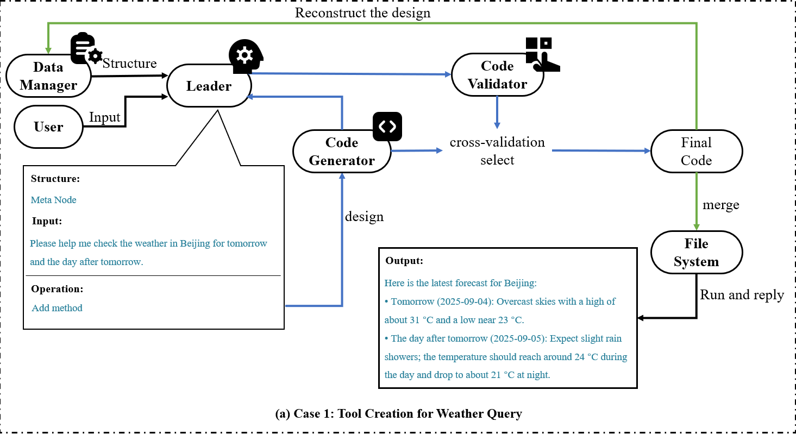
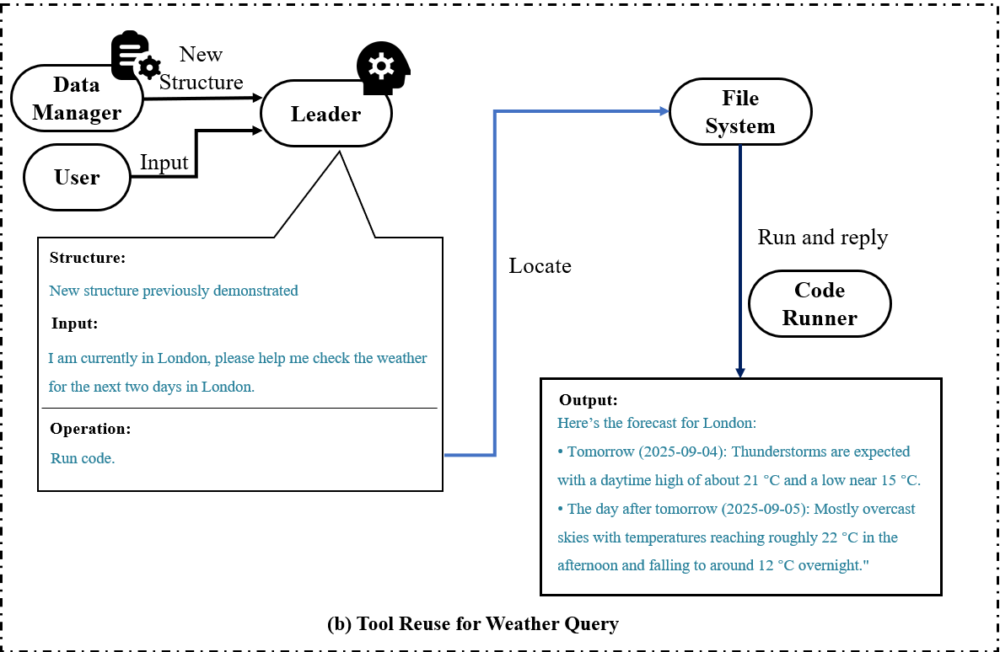

# 🤖 AI-Driven Self-Evolving Software

## 📖 Introduction

This repository contains the implementation and experimental code for the paper:

**AI-Driven Self-Evolving Software**

This repository provides:

* ✅ A working implementation of the core algorithm presented in the paper
* ⚙️ Scripts and configuration files to reproduce the reported experiments

---

## 📝 Abstract

Software automation has long been a central goal of software engineering, aiming to **minimize human intervention** in the development lifecycle.
Recent efforts have leveraged **Artificial Intelligence (AI)** to advance software automation with notable progress. However, current AI mainly serves as an **assistant** to human developers, leaving software development still dependent on explicit human input.

This raises a fundamental question:

> *Can AI move beyond its role as an assistant to become a core component of software, enabling genuine software automation?*

To investigate this, we introduce **AI-Driven Self-Evolving Software** — a new form of software that **evolves continuously** through direct interaction with users.

We demonstrate this vision with a **lightweight prototype** built on a multi-agent architecture that:

* 🧩 Interprets user requirements autonomously
* 🖥️ Generates and validates code
* 🔄 Integrates new functionalities seamlessly

Case studies across multiple scenarios show that the prototype can **reliably construct and reuse functionality**, providing early evidence that such systems can scale to sophisticated applications — paving the way toward **truly automated software development**.

---

## 🎬 Demo


---

## ⚡ Requirements

* **Python ≥ 3.12.11**
* Install dependencies:

```bash
pip install -r requirements.txt
```

---

## 📂 Directory Layout

```
repo/
├── src-v2.0/        # Source code for cross validation
├── src/        # Source code for unit-test
├── config.json # Configuration file
├── requirements.txt
├── demo.gif    # Demo GIF
├── figures
├── output.log # more cases provided in paper
└── README.md

```

---

## 🚀 Quick Start

1. Edit the `api_key` and `base_url` in the `config.json` file
2. Run the agent system:

```bash
python -m src.core.agent
```

---

✅ **Tip:** Make sure your Python environment is correctly set up before running the agent.

## 📋 Cases

Using weather prediction as an example, we explain how our method operates in detail. Additional examples can be found in the `output.log` file.

Initially, when no user operations have been performed, the system contains only a `Leader` node. The `Data Manager` maintains the Meta Node at this stage.

```
Code structure: {
    "type": "dir", 
    "children": {}
}
```



In the first round of interaction, the user submits an initial query: "Please help me check the weather in Beijing for tomorrow and the day after tomorrow."

Upon receiving the user's request, the `Leader` node intercepts both the query and the current data structure from the `Data Manager`. It then analyzes this information to generate subsequent instructions.

Based on this analysis, the `Leader` then dispatches the task to the `Code Generator`.

Once the `Leader` designates the `Code Generator` as the next step, the `Code Generator` produces the requisite code. This generated code is subsequently returned to the `Leader`, which then delegates it to the `Code Validator` for testing.

Upon completion of cross-validation among multiple code candidates and testing programs, the code with the highest confidence score is selected. This optimal code is subsequently persisted to the `Data Manager`, triggering a structural update.

```
Code structure: {
    'type': 'dir', 
    'children': {
        'weather_forecast.py': {
            'type': 'file', 
            'classes': [
                {
                'name': '_HTTPClient', 
                'members': ['_timeout'], 
                'methods': ['__init__', 'get_json']
                }
            ], 
            'functions': [
                '_geocode', 
                '_build_forecast_params', 
                'fetch_weather', 
                '_parse_cli', 
                'main'
            ], 
            'dependencies': [
                'requests', 
                'argparse', 
                'datetime', 
                'json', 
                'sys', 
                'typing'
            ], 
            'description': 'weather_forecast.py is a self-contained module exposing fetch_weather() and a CLI\nentry-point. It hides network details behind _HTTPClient, uses Open-Meteo APIs\nfor geocoding and daily forecasts, maps weather codes to human-readable\nconditions, and returns/prints a compact JSON string. The module validates\narguments, handles HTTP errors, and limits requests to 7 days ahead. Usage:\n    python weather_forecast.py --city "Beijing" --days 2\nOr programmatically:\n    from weather_forecast import fetch_weather\n    data_json = fetch_weather("Beijing", 2)'
        }
    }
}
```

The `Code Runner` ultimately executes the code to generate the response for the user.

---



In the second round of interaction, the user submits an query: "I am currently in London, please help me check the weather for the next two days in London."

As the structure maintained by the `Data Manager` has been updated following the previous query, the `Leader` now determines that the Code Generator can be bypassed, and the task can be directed straight to the `Code Runner` for execution.
